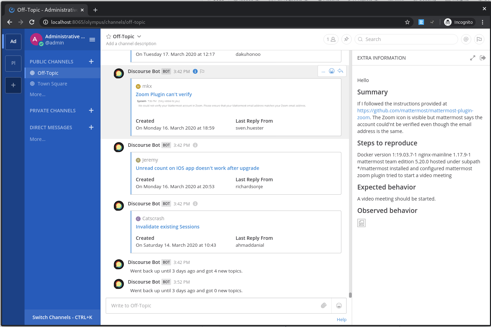

# Discourse Mattermost 'Bot'

This is a small integration that gets the latest posts from a Discourse forum and 
posts them to a given channel inside of Mattermost. 
If no new posts are found it returns nothing.

## Usage

1. Create an Incoming Webhook inside of Mattermost for the bot to use
2. Replace the values in the config.yaml.changeme and rename it to config.yaml
3. Start the app.py in a terminal of your choice. I'd suggest running it in screen or termux, 
    so you can leave it running in the background. 
    
```yaml
username: 'Discourse' # Name to be shown for the posts of this bot
icon_url: 'https://cdn3.iconfinder.com/data/icons/logos-and-brands-adobe/512/92_Discourse-512.png' # Icon url for the bot posts
webhook_url: 'http://localhost:8065/hooks/o1nhrjw47pda3ddz4yxgspck1e' # The webhook url this bot sends the posts to. 
forum_url: 'https://forum.mattermost.org' # The forum url the bot gets the posts from
channel_name: 'town-square' # id of the Mattermost channel to post to
sleep_time: 600 # Time in seconds between getting new posts
```

